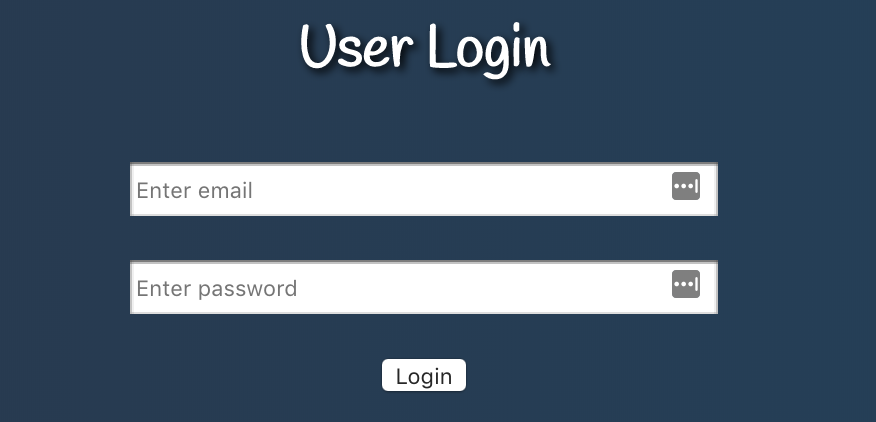
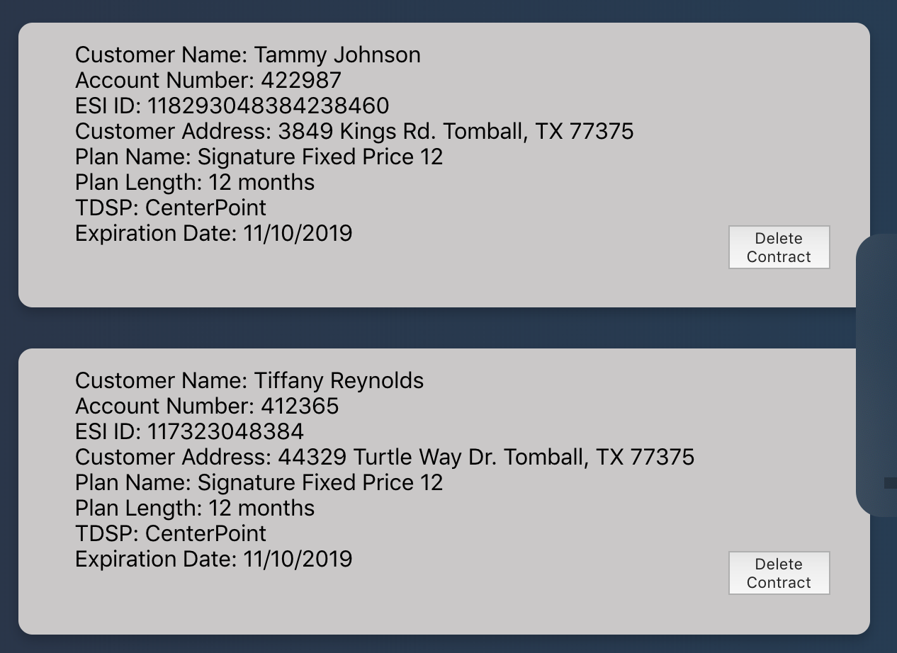
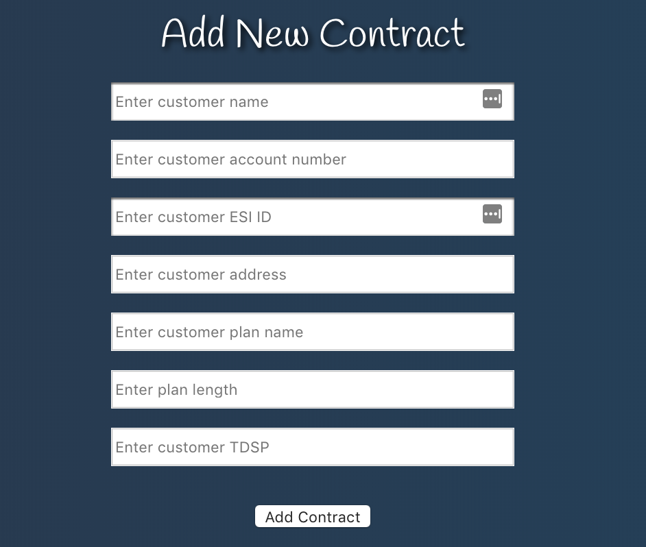

<h1>Contract Bay</h1>

<h1>Objective</h1>

Contract Bay was designed to display customer information stored in a database in an organized and easy to view manner.

<h1>Technology Used</h1>
MongoDB, Node.js, Express, React, Redux, JWT, CSS

<h2>Login</h2>

<h2>Registration</h2>

<h2>View all Contracts</h2>

<h2>Filter Contracts by Contract Length and Expiring Date</h2>

<h2>Add Contract</h2>

